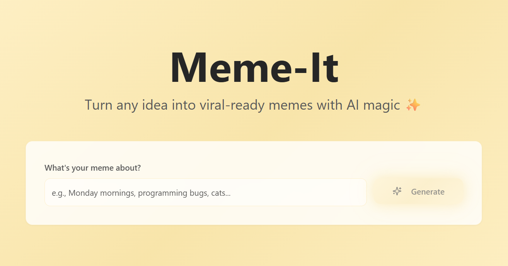

# 🎨 Meme-it  
**AI-Powered Meme Generator**

 <!-- Replace with your own image path -->

---

## 🧠 Overview
**Meme-it** is a playful, intelligent meme generator that turns your text ideas into ready-to-share memes.  
Powered by generative AI, it interprets your prompt, crafts a clever caption, and pairs it with the perfect visual style — creating viral-ready humor in seconds.

The project blends creativity and automation, showing how AI can personalize content generation for modern social media.

---

## ✨ Key Highlights
- 🪄 **Idea-to-Meme Pipeline** – Converts plain text ideas into meme templates with AI-generated captions.  
- 🎭 **Context-Aware Captioning** – Uses LLM-based text understanding to match tone, sarcasm, and style.  
- 🖼️ **Smart Image Selection** – Chooses or recommends relevant templates dynamically.  
- 💬 **Instant Preview & Download** – Lets users view, refine, and export memes immediately.  
- 🎨 **Brand-Free Experience** – Custom-themed UI with “Meme-it” watermark branding removed for a clean aesthetic.  

---

## 🧩 Tech Stack
| Layer | Technology |
|-------|-------------|
| **Frontend** | React (Vite) / Tailwind CSS |
| **Backend** | Node.js / Express |
| **AI Integration** | Gemini API (text + image generation) |
| **Data Handling** | Local storage for meme metadata |
| **Version Control** | Git & GitHub |
| **Deployment (optional)** | Render / Vercel |

---

## 🚀 Vision
Meme-it aims to explore **AI-driven humor creation** — blending natural language understanding with dynamic visual pairing.  
Future iterations will include:
- ✏️ Editable text overlays & custom templates  
- 📊 Engagement analytics and trend tracking  
- 🧩 Integration with social APIs for one-click sharing  

---

## 🧑‍💻 Author
Built with creativity and code by **Dedeepya Vesangi (dvesangi404)**. 

---
